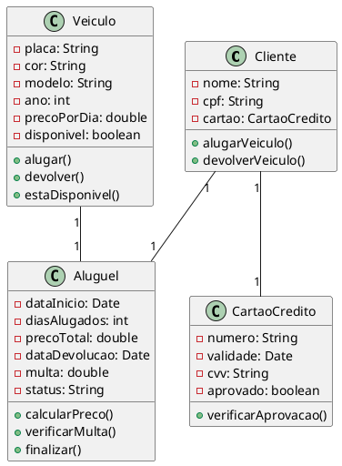

# Faculdade

```plantuml
@startuml
class Cliente {
  - nome: String
  - cpf: String
  - cartao: CartaoCredito
  + alugarVeiculo()
  + devolverVeiculo()
}

class Veiculo {
  - placa: String
  - cor: String
  - modelo: String
  - ano: int
  - precoPorDia: double
  - disponivel: boolean
  + alugar()
  + devolver()
  + estaDisponivel()
}

class Aluguel {
  - dataInicio: Date
  - diasAlugados: int
  - precoTotal: double
  - dataDevolucao: Date
  - multa: double
  - status: String
  + calcularPreco()
  + verificarMulta()
  + finalizar()
}

class CartaoCredito {
  - numero: String
  - validade: Date
  - cvv: String
  - aprovado: boolean
  + verificarAprovacao()
}

Cliente "1" -- "1" CartaoCredito
Cliente "1" -- "1" Aluguel
Veiculo "1" -- "1" Aluguel
@enduml
```
